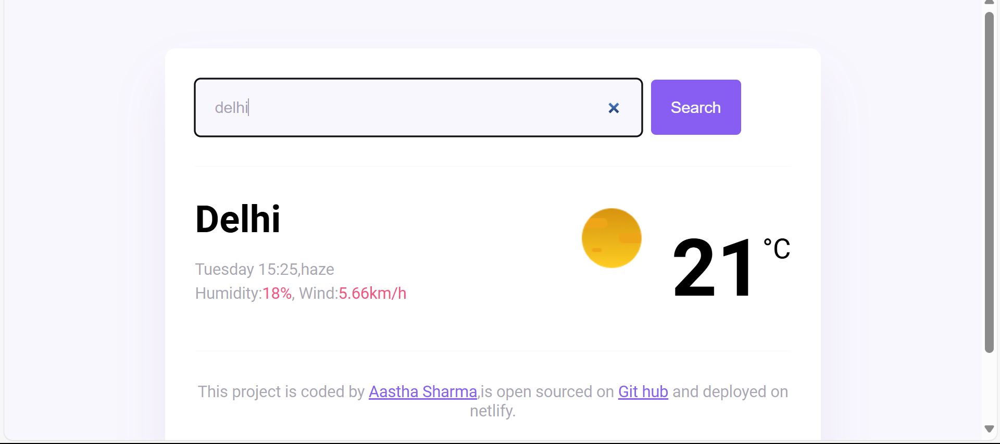

# Weather Forecast Webpage

This webpage provides real-time weather forecasts for various locations.

**Features:**

*   Current weather conditions
*   Current himdity and wind-speed
*   Location search functionality
*   User-friendly interface

**Technologies Used:**

*   **Frontend:** HTML, CSS, JavaScript
*   **API:** ShecodeWeather API

**Homepage:**

**Usage:**

1. Open your web browser 
2. Search for your desired location.
3. View the weather forecast.

**Contributing:**

Contributions are welcome! Please submit a pull request with a clear description of your changes.
